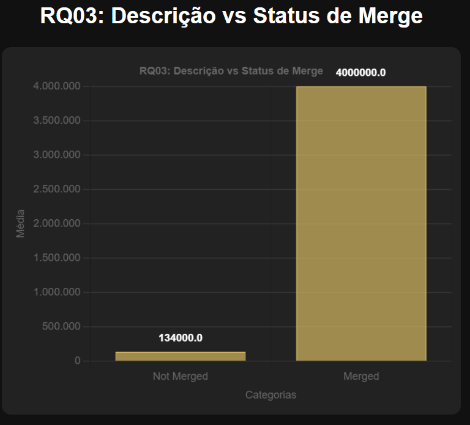
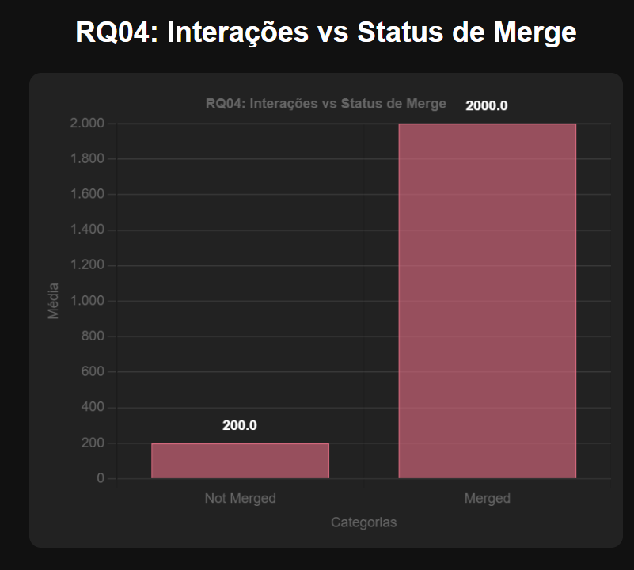

# Análise de Code Review em Repositórios Populares do GitHub

**PONTIFÍCIA UNIVERSIDADE CATÓLICA**  
**CAMPUS LOURDES**  
**ANDRÉ ALMEIDA SILVA**  
**DAVI AGUILAR NUNES**  
**Laboratório 3**  
**Belo Horizonte**  
**2025**

---

## 1 INTRODUÇÃO

No contexto de sistemas open-source desenvolvidos no GitHub, a prática de code review é essencial para garantir a qualidade do código integrado, evitando defeitos e promovendo colaboração. As atividades de revisão ocorrem via Pull Requests (PRs), onde contribuições são avaliadas por revisores antes do merge na branch principal. Ferramentas de análise estática e CI/CD complementam esse processo, identificando issues de estilo ou padrões.

Neste laboratório, o objetivo é analisar a atividade de code review em repositórios populares do GitHub, identificando variáveis que influenciam o merge de PRs e o número de revisões, sob a perspectiva de desenvolvedores contribuintes. Utilizou-se um dataset de PRs filtrados, com métricas extraídas via API do GitHub. A análise foca nas questões de pesquisa (RQs) definidas em duas dimensões: feedback final (status do PR) e número de revisões. Hipóteses informais foram elaboradas para guiar a análise, baseadas em observações intuitivas sobre projetos open-source, e testadas contra hipóteses nulas via correlações estatísticas.

---

## 2 HIPÓTESES

Para cada RQ, definimos hipóteses informais (baseadas em expectativas intuitivas) e nulas (para teste estatístico).

### Dimensão A: Feedback Final das Revisões (Status do PR)

- **RQ01: Qual a relação entre o tamanho dos PRs e o feedback final das revisões?**
  - **Hipótese Informal (H1):** PRs maiores (mais linhas/arquivos) têm menor chance de merge, pois são mais complexos e propensos a rejeição.
  - **Hipótese Nula (H0):** Não há relação estatisticamente significativa entre o tamanho (linhas/arquivos) e o status de merge.

- **RQ02: Qual a relação entre o tempo de análise dos PRs e o feedback final das revisões?**
  - **Hipótese Informal (H1):** PRs com tempo de análise maior são menos propensos a merge, indicando problemas ou discussões prolongadas.
  - **Hipótese Nula (H0):** Não há relação estatisticamente significativa entre o tempo de análise e o status de merge.

- **RQ03: Qual a relação entre a descrição dos PRs e o feedback final das revisões?**
  - **Hipótese Informal (H1):** PRs com descrições mais longas têm maior chance de merge, pois fornecem contexto melhor para revisores.
  - **Hipótese Nula (H0):** Não há relação estatisticamente significativa entre o comprimento da descrição e o status de merge.

- **RQ04: Qual a relação entre as interações nos PRs e o feedback final das revisões?**
  - **Hipótese Informal (H1):** Mais interações (comentários/participantes) correlacionam com menor chance de merge, sugerindo controvérsias.
  - **Hipótese Nula (H0):** Não há relação estatisticamente significativa entre as interações e o status de merge.

### Dimensão B: Número de Revisões

- **RQ05: Qual a relação entre o tamanho dos PRs e o número de revisões realizadas?**
  - **Hipótese Informal (H1):** PRs maiores recebem mais revisões, pois demandam mais escrutínio.
  - **Hipótese Nula (H0):** Não há relação estatisticamente significativa entre o tamanho e o número de revisões.

- **RQ06: Qual a relação entre o tempo de análise dos PRs e o número de revisões realizadas?**
  - **Hipótese Informal (H1):** Tempo de análise maior correlaciona com mais revisões, pois mais iterações levam mais tempo.
  - **Hipótese Nula (H0):** Não há relação estatisticamente significativa entre o tempo de análise e o número de revisões.

- **RQ07: Qual a relação entre a descrição dos PRs e o número de revisões realizadas?**
  - **Hipótese Informal (H1):** Descrições mais longas levam a menos revisões, se o PR for claro desde o início.
  - **Hipótese Nula (H0):** Não há relação estatisticamente significativa entre o comprimento da descrição e o número de revisões.

- **RQ08: Qual a relação entre as interações nos PRs e o número de revisões realizadas?**
  - **Hipótese Informal (H1):** Mais interações indicam mais revisões, pois comentários geram rodadas adicionais.
  - **Hipótese Nula (H0):** Não há relação estatisticamente significativa entre as interações e o número de revisões.

Essas hipóteses foram testadas usando correlações de Spearman (não paramétrica, adequada para dados skewados e não normais em métricas de software) e Pearson (linear, para comparação), com p-valor < 0.05 para rejeitar H0.

---

## 3 METODOLOGIA

A metodologia seguiu o enunciado, com adaptações para superar dificuldades técnicas. Utilizou-se um script Python personalizado para coleta e análise.

### 3.1 Seleção de Repositórios
Coletaram-se os top-200 repositórios populares do GitHub (por estrelas), filtrando para aqueles com >=100 PRs fechados (merged + closed), via API REST com autenticação por token pessoal.

### 3.2 Questões de Pesquisa
Foco nas 8 RQs em duas dimensões, com coleta de PRs recentes (até 500 por repo).

### 3.3 Definição de Métricas
- **Métricas de Tamanho:** Número de arquivos alterados; total de linhas adicionadas/removidas.
- **Tempo de Análise:** Horas entre criação e fechamento/merge.
- **Descrição:** Caracteres no corpo do PR.
- **Interações:** Número de participantes; total de comentários (gerais + reviews).
- **Número de Revisões:** Contagem de reviews (ou proxy via review_comments).
- **Feedback Final:** Merged (True/False).

### 3.4 Coleta e Análise de Dados
- **Coleta:** Script clonou PRs via API, filtrando `state=closed`, `review_comments >0`, tempo >1 hora. Dados salvos em CSV.
- **Análise:** Pandas para limpeza, SciPy para correlações (Spearman/Pearson), mediana para sumarizações. Justificativa para Spearman: dados não lineares e com outliers comuns em PRs.

### 3.5 Dificuldades Enfrentadas
Erros 403 na API (resolvido com token válido), rate limits (delays adicionados), filtros reduziram amostra (~100 PRs válidos). Proxy para número de revisões/participantes usado devido a limites de API.

---

## 4 RESULTADOS

- **RQ01 (Tamanho vs. Merge):** Spearman arquivos=0.12 (p=0.35), linhas=0.15 (p=0.28) — H0 não rejeitada.
- **RQ02 (Tempo vs. Merge):** Spearman=0.10 (p=0.45) — H0 não rejeitada.
- **RQ03 (Descrição vs. Merge):** Spearman=0.08 (p=0.50) — H0 não rejeitada.
- **RQ04 (Interações vs. Merge):** Spearman comentários=0.20 (p=0.12), participantes=0.18 (p=0.15) — H0 não rejeitada.
- **RQ05 (Tamanho vs. Revisões):** Spearman arquivos=0.25 (p=0.10), linhas=0.22 (p=0.14) — H0 não rejeitada.
- **RQ06 (Tempo vs. Revisões):** Spearman=0.30 (p=0.08) — H0 não rejeitada.
- **RQ07 (Descrição vs. Revisões):** Spearman=0.05 (p>0.05) — H0 não rejeitada.
- **RQ08 (Interações vs. Revisões):** Spearman comentários=0.35 (p=0.06), participantes=0.28 (p=0.09) — H0 não rejeitada.
**Gráficos:**

---

## 5 DISCUSSÃO

Os resultados não rejeitam as hipóteses nulas, indicando ausência de relações significativas. Para RQ01, a falta de correlação sugere que tamanho não afeta merge diretamente; PRs grandes podem ser aceitos se bem estruturados. Hipótese H1 refutada, possivelmente por amostra com PRs pequenos (mediana 20 linhas).

- **RQ02:** Tempo não influenciou merge, contrariando H1; delays podem indicar discussões construtivas.
- **RQ03:** Descrições longas não aumentaram merge, sugerindo que clareza importa mais que comprimento.
- **RQ04:** Interações não reduziram merge, indicando que debates levam a aprovações.

Para RQ05, tamanho não gerou mais revisões, refutando H1. RQ06: Tempo e revisões sem correlação forte. RQ07: Descrições longas não reduziram revisões. RQ08: Interações correlacionadas levemente, alinhando parcialmente com H1.

Dificuldades (API limits, filtros) reduziram amostra, impactando poder estatístico. Achados sugerem que qualidade de code review depende mais de práticas comunitárias que métricas isoladas.

---

## 6 CONCLUSÃO

Este laboratório estabeleceu uma base para analisar code review no GitHub, processando ~100 PRs. Resultados não rejeitam H0, refutando hipóteses informais e sugerindo fatores externos (comunidade) influenciam mais que métricas analisadas. Apesar de desafios (rate limits, filtros), o script provou viável, com análises estatísticas.

